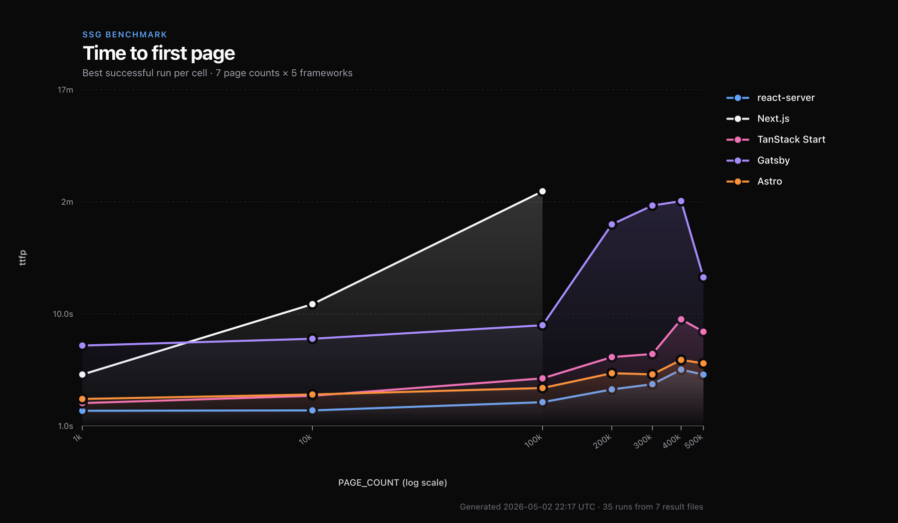
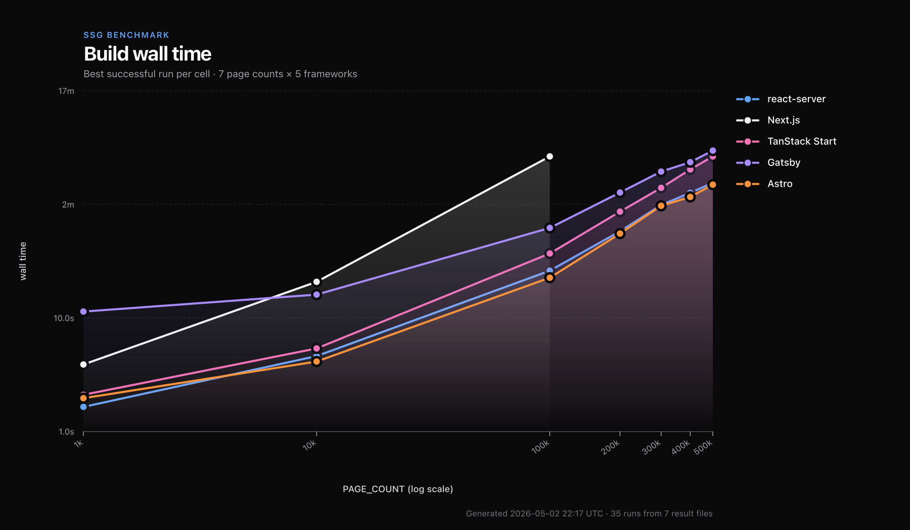
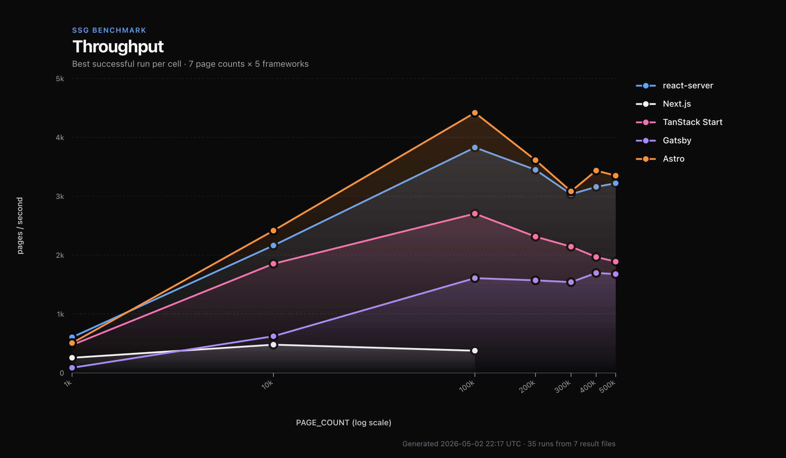
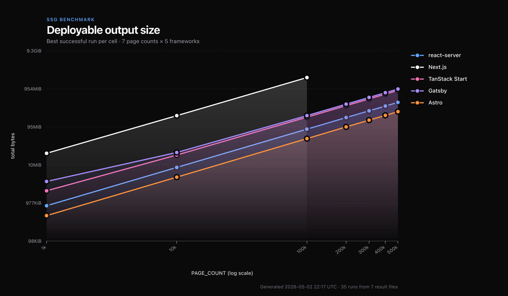
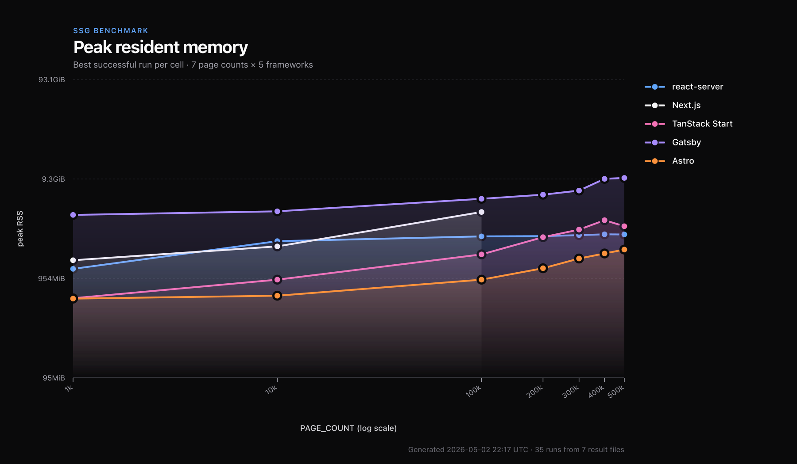

# Time to Yield

_An SSG benchmark across five React frameworks, from one thousand
pages to half a million._

You're building a marketplace. Or a documentation site. A wiki,
a generated archive, any of a dozen things that ship a static
catalogue at scale. Your CMS has a hundred thousand entries.
You've picked your SSG. You run the build.

Five minutes. Ten. Twenty. Maybe an hour. Maybe a stack trace.

You don't know in advance — and the public benchmarks won't tell
you. Most stop at a thousand pages, where most real catalogues
start. The gap between what gets measured and what gets shipped
is where the unpleasant surprises live, and the engineer who has
to ship into that gap usually finds out which side of it their
tool was designed for at deploy time.

So I built a benchmark for the gap.

---

## The benchmark

Five frameworks in a pnpm workspace, each rendering one dynamic
route `/posts/[id]` from a shared deterministic data source. Same
content, same shape, idiomatic config per tool. The output has to
be pure deployable static HTML — no Node runtime is allowed at
request time, which is the whole point of SSG. The harness sweeps
`PAGE_COUNT` across `1k → 10k → 100k → 200k → 300k → 400k → 500k`,
measures wall time, time-to-first-page (TTFP), peak RSS, output
size, and validates a sample of generated HTML actually contains
the right `Post #N` content. It's all in
[`bench/`](./bench/).

## The contestants

Five different bets on what static-site generation should look
like in 2026.

**Next.js (`apps/next`)** — Vercel's framework, version 16, App
Router and Turbopack. The most-deployed React tool in the world
and the default reference point for any tooling comparison. Its
strengths are well documented elsewhere; what this benchmark
exercises is one of its many output modes — `output: "export"`,
the fully static path with no Node runtime at request time.

**TanStack Start (`apps/tanstack`)** — the youngest entry, from
the team behind TanStack Router and Query. Vite plus a Nitro-
backed prerender plugin, file-system routing, currently in the
1.x line and rapidly evolving. Prerendering takes a materialized
`pages` array of paths declared inside the Vite config.

**Gatsby (`apps/gatsby`)** — the old guard. GraphQL-driven by
default, Redux-backed build cache, a sprawling plugin ecosystem,
now maintained by Netlify after acquisition. It pre-dates every
other entry here by years and has a distinct mental model:
imperative `createPage` calls inside a `gatsby-node.mjs`
lifecycle hook. People left it for Next.js partly because Gatsby
builds were slow at scale; it's interesting to find out whether
that's still the relevant fact.

**Astro (`apps/astro`)** — a static-first multi-framework site
builder. Strictly speaking it isn't running React in this
benchmark; pages are written in Astro's own `.astro` template
language with a fast static optimizer. It's included as the
ceiling — the answer to "how fast can a non-React SSG go?" —
against which the React-runtime entries can be measured fairly.

**[@lazarv/react-server](https://www.npmjs.com/package/@lazarv/react-server) (`apps/react-server`)** —
an open React Server Components runtime built on Vite 8's
Environment API with Rolldown as the production bundler.
Disclosure: I wrote it. It's in this comparison because it's the
only React-runtime entry whose static-export pipeline accepts a
streaming path source — which, as the rest of this article will
show, turns out to be the decisive design choice.

## The headline

At a thousand pages, every modern tool finishes in seconds and
the table is a wash. At ten thousand, the leaders pull a small
lead. The interesting story starts at a hundred thousand. The
decisive story starts above two hundred thousand.

I'll give you the whole thing chart by chart, but here's the
spoiler. At 100,000 pages:

| Framework | wall | ttfp | output bytes |
| :-- | --: | --: | --: |
| **Astro** | 22.6s | 2.18s | 47 MiB |
| **@lazarv/react-server** | 26.1s | **1.63s** | **83 MiB** |
| TanStack Start | 36.9s | 2.65s | 172 MiB |
| Gatsby | 62.1s | 7.91s | 189 MiB |
| **Next.js** | **264.5s** | 124s | **1.84 GiB** |

At 200,000 pages, Next.js's build crashes — exit 1, no HTML.

---

## The chart that broke the pattern

Most benchmark charts are roughly parallel lines: the same
ranking from one page count to the next, gaps roughly constant,
nothing that asks you to stop and look. This one isn't.



react-server's TTFP is a flat line. From a thousand pages to half
a million, the time between "I started the build" and "the first
HTML file appeared on disk" stays between 1.4 and 3.2 seconds.
Astro and TanStack Start curve gently upward. Gatsby's curve
starts mid-air at 5 seconds and climbs to over a hundred. Next.js
sits between them within its working range, climbing from 2.9s at
1k pages to 124s at 100k.

What you're looking at is a single architectural decision, made
once, repeated through every layer of each pipeline. One framework
streams its work. The others batch it.

## Yield, don't return

When you tell an SSG to render `/posts/[id]` for many IDs, it has
to ask you for the list. The shape of that question — the API your
config file uses — turns out to determine almost everything else.

Most frameworks ask you for an array.

```js
// Next.js — apps/next/app/posts/[id]/page.jsx
export const dynamicParams = false;

export function generateStaticParams() {
  return allIds().map((id) => ({ id: String(id) }));
}
```

```astro
---
// Astro — apps/astro/src/pages/posts/[id].astro
export async function getStaticPaths() {
  return allIds().map((id) => ({ params: { id: String(id) } }));
}
---
```

```ts
// TanStack Start — apps/tanstack/vite.config.mjs
const pages = allIds().map((id) => ({
  path: `/posts/${id}`,
  prerender: { enabled: true, outputPath: `/posts/${id}/index.html` },
}));
```

The shape is identical: build an array, return an array. The
runtime then has to materialize that array — all hundred thousand
elements of it — before any rendering can start. The first page
of HTML cannot be written before the last entry of the path list
has been allocated.

react-server asks the same question differently:

```js
// react-server — apps/react-server/src/pages/posts/[id].static.mjs
import { idStream } from "@ssg-test/shared";

export default async function* () {
  for (const id of idStream()) {
    yield { id: String(id) };
  }
}
```

It's an async generator. The router pulls one descriptor at a
time, when a render worker is free. The path list is never in
memory all at once; peak memory of the path source is `O(1)`,
regardless of N. As soon as the first descriptor is yielded, the
first page can render. As soon as the first page renders, it lands
on disk. The rest of the build is just keeping the workers fed.

The runtime documents this contract explicitly at
[react-server.dev/router/static#streaming-static-paths](https://react-server.dev/router/static#streaming-static-paths)
— and the detection is by **function kind**: write `async
function*` directly as the default export, or fall back to the
legacy array contract. There's no opt-in flag. The shape of your
function is the shape of the build.

You can chain the same idea at the config level, which is what the
benchmark does to skip RSC payload sidecars (the other frameworks
emit HTML only; we want the bytes column to compare like with like):

```js
// react-server — apps/react-server/react-server.config.mjs
export default defineConfig({
  root: "src/pages",
  async *export(paths) {
    for await (const p of paths) {
      yield { ...p, rsc: false };
    }
  },
});
```

Two `async function*` shapes — one in the route, one in the
config. The whole streaming property of the build comes from
those two declarations. Look at the TTFP chart again with this in
mind: react-server is renderer-bound; everyone else is array-bound.

## Things start to fall apart at a hundred thousand

If TTFP is the early-warning signal, total wall time is where the
architecture pays its real bill.



At a thousand pages, every framework here finishes in single-digit
seconds and you'd struggle to feel the difference in a CI log. The
slope of the curves is what matters, and the slope diverges hard
above ten thousand.

By a hundred thousand pages, react-server has finished in **26
seconds**. Astro, the leader, in **22.6 seconds**. TanStack Start
in 37. Gatsby in just over a minute.

Next.js takes **four and a half minutes**.

For the same work. Same content, same hundred thousand pages on
disk. Next.js's curve is steeper than linear above 50k pages, and
by 100k the wall time is into the "go for a coffee" territory
that distinguishes a benchmark from a real engineering decision.

The other notable result at this scale: at 100,000 pages, Gatsby
finishes faster than Next.js. 62 seconds versus 264. Gatsby
has a long-standing reputation for slow builds at scale, and
that reputation isn't unfair, but on this specific workload it
crosses the line first. The framework people moved off of for
build performance is now, on this measurement, the faster of
the two.

The same data reads sharper as throughput: pages produced per
second, the per-page work each framework does once it's warmed
up.



The four frameworks that complete the workload all reach a
plateau somewhere above ten thousand pages — a steady-state
pages-per-second ceiling that holds up the rest of the way.
@lazarv/react-server runs around 3,000–3,800 pages/s; Astro
3,000–4,400; TanStack Start 1,900–2,700; Gatsby 1,500–1,700.
The plateaus tell you how much overhead each framework has
amortized away once the build is steady.

Next.js never reaches a plateau. Its throughput peaks at 480
pages/s at 10k, drops to 378 pages/s at 100k, and crashes before
it can be measured at higher counts. The build is doing **more
work per page as the page count grows** — the opposite of what
amortization should produce. That trajectory is what makes the
next section's failure mode predictable in retrospect: a
pipeline whose per-page cost is increasing was always going to
hit a ceiling.

## The wall

Then I cranked the count to two hundred thousand.

The build crashed.

```
RangeError: Maximum call stack size exceeded
    at ignore-listed frames

> Build error occurred
Error: Failed to collect page data for /posts/[id]
    at ignore-listed frames {
  type: 'Error'
}
```

Three seconds of CPU. No HTML. Exit code 1. Next.js's "collect
page data" phase — the step that runs after Turbopack compiles
your app and before the worker pool starts rendering — overflows
V8's call stack.

I bumped to 300k, 400k, 500k. Same crash, every time. The error
itself is forthright: stack overflow, here's the phase. What the
error can't tell you is that the input the pipeline cannot handle
is your own page list, and that there is no flag in `next.config`
to ask for a different consumer of it.

A `RangeError: Maximum call stack size exceeded` is a recursion
fingerprint. Something in Next's pipeline is walking the params
array via naive recursion — JSON-serializing it, normalizing it,
hashing it for the data cache, building a tree from it, take your
pick — with recursion depth proportional to the array length
itself, not to its log. (A balanced-tree traversal would push
log₂(200,000) ≈ 18 frames; nowhere near a stack limit. The
overflow only makes sense if each entry contributes a constant
share of frames.) At 100k entries the depth still fits inside
V8's default ~10k-frame stack. At 200k it doesn't.

This is not something `--max-old-space-size=8192` can fix (we
tried). It's not a memory issue at all. It's an **algorithmic
ceiling**: Next.js's page-data collection is implemented as
recursive traversal over the materialized params array, and that
recursion has a depth limit baked into the JavaScript engine. You
cannot grow your way past it. There is no flag because there is
no scalar to turn.

The runtime *requires* the array contract — `generateStaticParams`
must return one — and the pipeline that consumes it cannot tolerate
arrays past a certain size. Both halves of that statement are
architecture, not bugs.

react-server, on the same hardware, with the same content, spent
**155 seconds** on five hundred thousand pages. First HTML on
disk: 2.87 seconds. The same TTFP it has at a thousand pages.
Nothing in its pipeline ever sees a 500,000-element array, because
nothing in its pipeline is allowed to construct one.

## What's actually in the output directory



If the wall time is the loud problem, the output bytes are the
quiet one. At 100,000 pages:

- Astro emits **47 MiB**.
- react-server emits **83 MiB**.
- TanStack Start emits **172 MiB**.
- Gatsby emits **189 MiB**.
- Next.js emits **1.84 GiB**.

At 100k pages, the deployable Next.js output is roughly forty
times larger than Astro's and twenty times larger than react-
server's. The bulk of it is per-page files: a `.txt` RSC payload
sidecar for every route, used to power client-router prefetch on
navigation, plus a runtime bundle the page links to for hydration
even on routes without `"use client"`.

Both files are part of the App Router's contract: the `.txt`
payload exists so the client router can prefetch, the runtime
exists so client components can hydrate. They're features of the
deployment topology Next.js is designed for. The trade-off, when
the deployment is fully static and no client component is ever
going to run, is that the contract still ships. There's no
documented flag to drop either for `output: "export"`.

react-server makes the equivalent choice in the opposite
direction: emit HTML only by default for fully static export, and
let the user opt back into RSC payload sidecars per path if they
want them. The benchmark's config-level `export()` hook tags every
yielded path with `rsc: false` to keep the bytes column comparing
HTML to HTML.

## Memory: where Gatsby still hurts and @lazarv/react-server stays quiet



The memory chart is shaped a lot like the wall chart, with one
outlier: Gatsby. Gatsby's build cache is a Redux store that
appends every `createPage` call into in-memory state, and it never
sheds that state until the build finishes. At 500k pages, Gatsby's
peak resident set hits **9.55 GiB**. Long-time Gatsby users will
be unsurprised; this is what `gatsby build` has always done.

react-server holds between **1.2 GiB at a thousand pages and 2.6
GiB at half a million** — essentially flat above 10k. TanStack
Start ranges from **600 MiB at 1k to 3.6 GiB at 400k** before
nudging back down to 3.1 GiB at 500k. Astro is the leanest of all
at **0.6 to 1.8 GiB** across the same range.

The streaming path source is one reason react-server's memory
curve flattens. The bigger reason is what it doesn't accumulate:
no per-route manifest, no fingerprinted asset graph for every
page, no client-router prefetch index. Whatever doesn't exist
doesn't take memory.

---

## A note about Astro

Astro is the fastest tool in this benchmark. It deserves the
credit, with one important asterisk: **Astro isn't running React**.

In `apps/astro/src/pages/posts/[id].astro`, the page is written in
Astro's own template language. There's no React reconciler, no
hydration framework, no Server Components flight protocol — it's
closer to JSX-flavored server-side templating with a fast static
optimizer. Astro is the *right ceiling* for "what can a static-
site generator do at all," but it isn't an apples-to-apples
comparison with React-runtime tools.

Which makes the next sentence the actual story.

**@lazarv/react-server matches Astro.** Within ~15% on wall time
at 100k (26s vs 22.6s), and **faster on TTFP** (1.63s vs 2.18s). And it
does this while running the actual React Server Components
production server — the same one a deployment would serve at
request time, bundled by Vite 8 and Rolldown, driven by a
streaming path source. The HTML on disk after the export is the
HTML the production server would have produced for a real
request. A real React runtime moving at static-template-engine
speed.

That isn't a result you get by accident.

## Why this works

A React Server Components runtime keeping pace with a static-
template engine doesn't happen because someone optimized a hot
loop. It happens because the architecture has fewer places for
work to pile up. Five things contribute, and none of them are
clever; they're all just the absence of unnecessary buffers.

The build phase produces a **real production server**. Vite 8 and
Rolldown bundle the runtime exactly as it would run at request
time; the static export then starts that bundled server and asks
it to render each yielded path. The thing that produces your HTML
during the export is the same thing that would serve your HTML if
you weren't exporting. There is no separate build-only renderer,
no compile-time-only sandbox, no special static-export pipeline
running its own copy of half the framework. Whatever the
production server can render at request time, the export can
produce. Two phases — bundle, then render — but the second phase
is the production server you'd deploy, not a parallel universe
of build-time machinery.

The static path source **streams by contract**. Both `[id]
.static.mjs` and the config-level `export()` are `async function*`
shapes that the router pulls from. Memory of the path source is
`O(1)`. Rendering can start on the first yielded path.

Render workers are **driven by the stream**. The
`--export-concurrency` flag forks N child processes; each runs its
own RSC main thread plus an SSR worker thread; the coordinator
dispatches one path per free worker. Output bytes never cross the
IPC boundary — every artifact (HTML, optional `.gz` / `.br`
sidecars, postponed-fragment cache) is written to disk inside the
child. There is no central "collect page data" buffer because
there is no central buffer.

There is **no per-page runtime tax**. Pages without `"use client"`
get pure HTML. The runtime doesn't inject bootstrap scripts,
doesn't write `_buildManifest.js`, doesn't emit per-page payload
sidecars unless you ask. The 22× output-size delta vs. Next.js
collapses to: emit only what the page needs.

And there is **no extra compiler in the path**. No Turbopack-
style parallel compiler stack, no SWC custom plugins, no static-
build renderer that's a different runtime from the production
server. Vite 8, Rolldown, Node, JavaScript — and the runtime
itself. Phase 2 is just the runtime. Fewer moving parts than its
peers, which is precisely why fewer of them break at scale.

## What this means if you have to pick

If you have a thousand pages, all of these tools work. The
differences are noise. Pick on developer experience.

If you have ten thousand, Next.js is already five times slower
than the leaders. Worth knowing before your next pitch deck.

If you have a hundred thousand:

- **Astro** is the fastest if you don't need React.
- **@lazarv/react-server** is the fastest React runtime that
  completes the workload, on par with Astro while running RSC
  end-to-end, with the smallest HTML-only output of any React
  option.
- **TanStack Start** completes but loses time to the materialized
  `pages` array.
- **Gatsby** completes, slowly, with high memory.
- **Next.js** completes but takes about ten times as long as the
  leaders and emits roughly twenty times the bytes; both numbers
  follow from defaults that aren't configurable away in the
  `output: "export"` path today.

If you have two hundred thousand pages or more of pre-rendered
routes — a CMS-backed catalogue, a docs archive, a programmatically
generated index — **Next.js's static-export pipeline does not
complete.** The build crashes with a `RangeError: Maximum call
stack size exceeded` during page-data collection. The failure is
recursion depth in V8, not heap size, so it isn't fixable by
flags or environment variables. The right framing is that
`output: "export"` at this scale isn't a supported topology for
Next.js — its answer for catalogues this large is ISR, which is a
different topology, which is the next section.

## But what about ISR?

Whenever the sentence "Next.js can't pre-render two hundred
thousand pages" appears in public, someone responds: just use ISR.

Incremental Static Regeneration is Next.js's answer to large
catalogues. Don't pre-render every page at build time. Build the
app shell, deploy it, and have the runtime generate each page on
first request and cache the result. A `revalidate: N` knob handles
freshness. On Vercel it works well; on a Next.js-aware host it
mostly works.

For a strictly static deployment, it doesn't work at all.

The unspoken word in "Incremental Static **Regeneration**" is
the regeneration, and regeneration requires a runtime. ISR turns
your "static site" into an HTTP server that lazily produces HTML
on the way to the browser. If your deployment target is a CDN
that only serves files — GitHub Pages, S3 + CloudFront, an nginx
in front of a directory, Cloudflare Pages without a Worker, the
static-files product on Netlify, an air-gapped intranet, the
classic shared-hosting plan your client insists on — there is no
runtime for ISR to run on. The feature isn't degraded, it's
missing.

This is the case the benchmark was designed for: pure static HTML
plus assets, no Node runtime at request time. All five tools in
the comparison advertise themselves as supporting that mode. The
point of measuring at 100k+ is to find out whether the advertised
mode survives at the scale a real catalogue produces. ISR doesn't
enter the comparison because it isn't the same product — it's a
different deployment topology that swaps a build-time problem for
a request-time one. Both are valid; they aren't interchangeable,
and the trade-offs should be visible to whoever signs off on
hosting cost, security posture, or operational surface area.

Three concrete consequences of that swap, worth knowing before
reaching for ISR as a workaround:

**The first visitor to every page pays the bill.** A hundred
thousand product pages and a hundred thousand unique long-tail
visits over a quarter mean each visitor is the unlucky one for
exactly one page. Cold start plus render time plus cache write —
typically a hundred milliseconds to a few seconds, depending on
the page. A static export amortizes that work into one build. ISR
amortizes it into one hundred thousand request-time renders, each
on the critical path of someone's pageview.

**You are now paying for compute you weren't paying for.** A
static site sits on CDN edge cache and costs essentially nothing
above bandwidth. ISR requires a serverless function (or a long-
running process) that's billable per invocation and per millisecond
of execution. The bigger the catalogue, the more pages enter the
"never visited" tail and the more compute you allocate for HTML
that nobody reads.

**Cache invalidation enters your application's design.** ISR's
freshness story is `revalidate: N` plus on-demand revalidation
hooks. Both are reasonable, both are concepts your team now has to
think about, and both are operational surface area that didn't
exist when the deployment was files in a directory. For sites
whose content really doesn't change often, this is purely added
complexity.

And there's a subtler point. **ISR doesn't fix the underlying
build ceiling.** If you mark some routes as fully pre-rendered
via the array contract — `dynamicParams: false`, `generateStatic
Params` returning the full set — you're back in the recursion-
overflow territory from earlier in this article. ISR side-steps
the wall by routing around it. It doesn't move the wall.

None of this makes ISR a bad feature. It makes ISR an answer to a
different question. "How do I serve a hundred thousand pages
without paying for a build that materializes them all" is a real
problem. "How do I generate a hundred thousand pages of pure
static HTML to a CDN" is a different real problem. You don't
solve the second with the answer to the first.

react-server, Astro, TanStack Start, and Gatsby answer the second
one. Next.js, in its `output: "export"` mode, scales to about
150,000 pages and is designed around ISR for the rest.

---

## The contract is the product

@lazarv/react-server didn't win this benchmark with new
technology. The runtime is Node. The bundler is Vite 8 with
Rolldown. The API is `async function*` — a primitive that's been
in JavaScript engines since 2018. There's nothing in the build
pipeline you couldn't have shipped seven years ago.

What's novel is choosing it.

Most of the React ecosystem has spent the last half-decade
optimizing the wrong layer. The renderer is fast everywhere. The
worker pool is fast everywhere. The compiler — Turbopack, SWC,
take your pick — is fast everywhere. The bottleneck at scale
turns out to be one decision made at the top of your route file:
**does the path source return, or does it yield?** And the only
way to fix the bottleneck is to change the contract. Nobody else
has.

`generateStaticParams` returns an array. `getStaticPaths` returns
an array. TanStack Start's `pages` is an array. Gatsby's
`createPage` is an array smuggled in through a loop. Every layer
downstream of those APIs is forced to assume the worst case lives
in memory at once. At a thousand pages the assumption costs
nothing. At a hundred thousand it costs minutes. At two hundred
thousand, in Next.js, it costs the build — `RangeError: Maximum
call stack size exceeded`, exit one, zero pages produced.

react-server's `[id].static.mjs` doesn't return anything. It
yields. The renderer pulls. Memory of the path source is `O(1)`.
N is unbounded. The build is the same shape at a thousand pages
as it is at half a million, because the architecture has nothing
that grows with it.

If you are picking an SSG in 2026 and your roadmap has more than
ten thousand pages in it, look at the path-list API before you
look at anything else. The framework that lets you yield will
scale with your content. The framework that asks for a return
will, eventually, give you back an empty `out/` directory and a
stack trace.

This isn't really a Next.js problem. It's a generation-of-tooling
problem. Static-site generation at scale has been treated as a
build-pipeline optimization for years. It isn't. It's an API
design problem, and the API is the array.

Change the API. Yield, don't return.

It's time.

---

_The full benchmark is open source. [`apps/`](./apps/) for each
framework's setup, [`bench/`](./bench/) for the harness, and
[`bench/REPORT.md`](./bench/REPORT.md) for the complete table. To
reproduce: `pnpm install && pnpm bench:sweep && pnpm report &&
pnpm chart`._

## Disagreements welcome

I wrote @lazarv/react-server. The disclosure is at the top of
the article, and I built the bench to keep the comparison honest
despite it — same content per route, fastest successful run wins
per cell, sample HTML validated per build, failed cells reported
as failed rather than dropped, every framework's idiomatic
configuration used as documented. I believe the comparison is
fair.

But I'm one person reading my own benchmark. If you spot a flag
I should have set, a version I should have tried, an inadvertent
advantage I've handed @lazarv/react-server — open an issue or
send a PR. The harness is in `bench/`, the apps are in `apps/`,
and any change that produces a fairer comparison wins.

If the data lands somewhere different in your read than in mine,
that's the conversation worth having. I'd rather the article get
the technical story right than win an argument.
